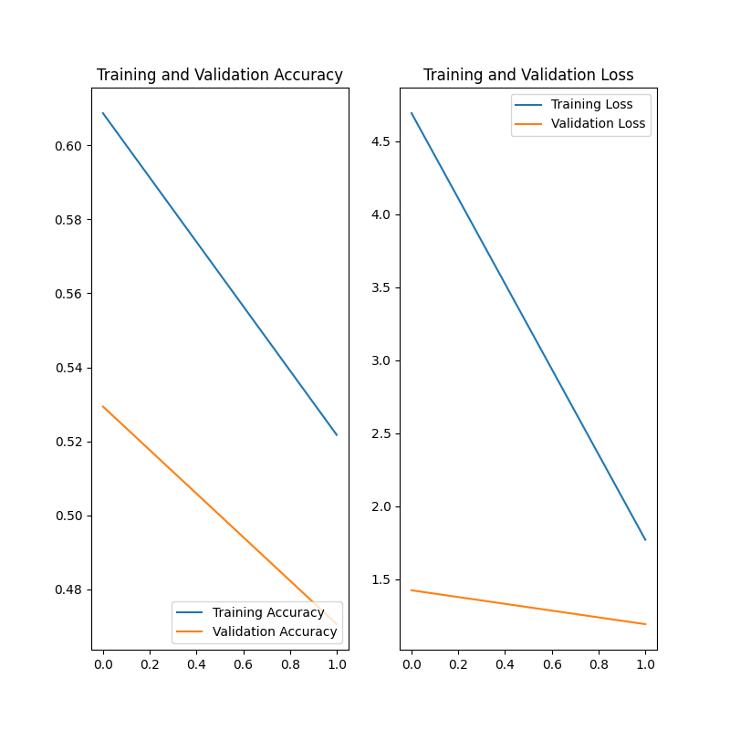

Confidence and Accuracy Report
==============================

# Threshold Value


The threshold value is 50.0.
## Confidence/Accuracy Above the Threshold


The average confidence level above the threshold is: 99.66057275616845

The average accuracy level above the threshold is: 0.4069767441860465

The data is in Appendix A
### Confidence/Accuracy Below the Threshold


The average confidence level below the threshold is: 0

The average accuracy level below the threshold is: 0

The data is in Appendix B
#### Training Accuracy and Loss for Validation vs Training data


```
mdFile.new_line(mdFile.new_inline_image(text='training_data', path='training_data.png'))
```  

##### Appendix A
Path to Image: C:\Users\tkwok7\PycharmProjects\gtriScreenClassification\testing_set\CatsDogs\cats\cat.1.jpg     
Confidence Level: 99.21185374259949     Predicted Label: dogs   Actual Label: cats
Path to Image: C:\Users\tkwok7\PycharmProjects\gtriScreenClassification\testing_set\CatsDogs\cats\cat.10.jpg    
Confidence Level: 99.69102144241333     Predicted Label: dogs   Actual Label: cats
Path to Image: C:\Users\tkwok7\PycharmProjects\gtriScreenClassification\testing_set\CatsDogs\cats\cat.11.jpg    
Confidence Level: 99.86966252326965     Predicted Label: dogs   Actual Label: cats
Path to Image: C:\Users\tkwok7\PycharmProjects\gtriScreenClassification\testing_set\CatsDogs\cats\cat.12.jpg    
Confidence Level: 99.73958730697632     Predicted Label: dogs   Actual Label: cats
Path to Image: C:\Users\tkwok7\PycharmProjects\gtriScreenClassification\testing_set\CatsDogs\cats\cat.13.jpg    
Confidence Level: 99.95012879371643     Predicted Label: dogs   Actual Label: cats
Path to Image: C:\Users\tkwok7\PycharmProjects\gtriScreenClassification\testing_set\CatsDogs\cats\cat.14.jpg    
Confidence Level: 99.3156373500824      Predicted Label: dogs   Actual Label: cats
Path to Image: C:\Users\tkwok7\PycharmProjects\gtriScreenClassification\testing_set\CatsDogs\cats\cat.15.jpg    
Confidence Level: 98.9224910736084      Predicted Label: dogs   Actual Label: cats
Path to Image: C:\Users\tkwok7\PycharmProjects\gtriScreenClassification\testing_set\CatsDogs\cats\cat.16.jpg    
Confidence Level: 99.84453916549683     Predicted Label: dogs   Actual Label: cats
Path to Image: C:\Users\tkwok7\PycharmProjects\gtriScreenClassification\testing_set\CatsDogs\cats\cat.17.jpg    
Confidence Level: 99.88085627555847     Predicted Label: dogs   Actual Label: cats
Path to Image: C:\Users\tkwok7\PycharmProjects\gtriScreenClassification\testing_set\CatsDogs\cats\cat.18.jpg    
Confidence Level: 99.94457960128784     Predicted Label: dogs   Actual Label: cats
Path to Image: C:\Users\tkwok7\PycharmProjects\gtriScreenClassification\testing_set\CatsDogs\cats\cat.19.jpg    
Confidence Level: 99.16256666183472     Predicted Label: dogs   Actual Label: cats
Path to Image: C:\Users\tkwok7\PycharmProjects\gtriScreenClassification\testing_set\CatsDogs\cats\cat.2.jpg     
Confidence Level: 99.94779825210571     Predicted Label: dogs   Actual Label: cats
Path to Image: C:\Users\tkwok7\PycharmProjects\gtriScreenClassification\testing_set\CatsDogs\cats\cat.20.jpg    
Confidence Level: 99.96757507324219     Predicted Label: dogs   Actual Label: cats
Path to Image: C:\Users\tkwok7\PycharmProjects\gtriScreenClassification\testing_set\CatsDogs\cats\cat.21.jpg    
Confidence Level: 99.93042945861816     Predicted Label: dogs   Actual Label: cats
Path to Image: C:\Users\tkwok7\PycharmProjects\gtriScreenClassification\testing_set\CatsDogs\cats\cat.22.jpg    
Confidence Level: 99.39146637916565     Predicted Label: dogs   Actual Label: cats
Path to Image: C:\Users\tkwok7\PycharmProjects\gtriScreenClassification\testing_set\CatsDogs\cats\cat.23.jpg    
Confidence Level: 99.96063113212585     Predicted Label: dogs   Actual Label: cats
Path to Image: C:\Users\tkwok7\PycharmProjects\gtriScreenClassification\testing_set\CatsDogs\cats\cat.24.jpg    
Confidence Level: 99.7344434261322      Predicted Label: dogs   Actual Label: cats
Path to Image: C:\Users\tkwok7\PycharmProjects\gtriScreenClassification\testing_set\CatsDogs\cats\cat.25.jpg    
Confidence Level: 99.76277351379395     Predicted Label: dogs   Actual Label: cats
Path to Image: C:\Users\tkwok7\PycharmProjects\gtriScreenClassification\testing_set\CatsDogs\cats\cat.26.jpg    
Confidence Level: 99.83671307563782     Predicted Label: dogs   Actual Label: cats
Path to Image: C:\Users\tkwok7\PycharmProjects\gtriScreenClassification\testing_set\CatsDogs\cats\cat.27.jpg    
Confidence Level: 99.82174634933472     Predicted Label: dogs   Actual Label: cats
Path to Image: C:\Users\tkwok7\PycharmProjects\gtriScreenClassification\testing_set\CatsDogs\cats\cat.28.jpg    
Confidence Level: 99.76244568824768     Predicted Label: dogs   Actual Label: cats
Path to Image: C:\Users\tkwok7\PycharmProjects\gtriScreenClassification\testing_set\CatsDogs\cats\cat.29.jpg    
Confidence Level: 99.96603727340698     Predicted Label: dogs   Actual Label: cats
Path to Image: C:\Users\tkwok7\PycharmProjects\gtriScreenClassification\testing_set\CatsDogs\cats\cat.3.jpg     
Confidence Level: 99.9794602394104      Predicted Label: dogs   Actual Label: cats
Path to Image: C:\Users\tkwok7\PycharmProjects\gtriScreenClassification\testing_set\CatsDogs\cats\cat.30.jpg    
Confidence Level: 99.97611045837402     Predicted Label: dogs   Actual Label: cats
Path to Image: C:\Users\tkwok7\PycharmProjects\gtriScreenClassification\testing_set\CatsDogs\cats\cat.31.jpg    
Confidence Level: 99.98264908790588     Predicted Label: dogs   Actual Label: cats
Path to Image: C:\Users\tkwok7\PycharmProjects\gtriScreenClassification\testing_set\CatsDogs\cats\cat.32.jpg    
Confidence Level: 99.99912977218628     Predicted Label: dogs   Actual Label: cats
Path to Image: C:\Users\tkwok7\PycharmProjects\gtriScreenClassification\testing_set\CatsDogs\cats\cat.33.jpg    
Confidence Level: 98.70884418487549     Predicted Label: dogs   Actual Label: cats
Path to Image: C:\Users\tkwok7\PycharmProjects\gtriScreenClassification\testing_set\CatsDogs\cats\cat.34.jpg    
Confidence Level: 99.80211853981018     Predicted Label: dogs   Actual Label: cats
Path to Image: C:\Users\tkwok7\PycharmProjects\gtriScreenClassification\testing_set\CatsDogs\cats\cat.35.jpg    
Confidence Level: 99.48568344116211     Predicted Label: dogs   Actual Label: cats
Path to Image: C:\Users\tkwok7\PycharmProjects\gtriScreenClassification\testing_set\CatsDogs\cats\cat.36.jpg    
Confidence Level: 99.99281764030457     Predicted Label: dogs   Actual Label: cats
Path to Image: C:\Users\tkwok7\PycharmProjects\gtriScreenClassification\testing_set\CatsDogs\cats\cat.37.jpg    
Confidence Level: 98.07536602020264     Predicted Label: dogs   Actual Label: cats
Path to Image: C:\Users\tkwok7\PycharmProjects\gtriScreenClassification\testing_set\CatsDogs\cats\cat.38.jpg    
Confidence Level: 99.86205697059631     Predicted Label: dogs   Actual Label: cats
Path to Image: C:\Users\tkwok7\PycharmProjects\gtriScreenClassification\testing_set\CatsDogs\cats\cat.39.jpg    
Confidence Level: 97.70290851593018     Predicted Label: dogs   Actual Label: cats
Path to Image: C:\Users\tkwok7\PycharmProjects\gtriScreenClassification\testing_set\CatsDogs\cats\cat.4.jpg     
Confidence Level: 99.65300559997559     Predicted Label: dogs   Actual Label: cats
Path to Image: C:\Users\tkwok7\PycharmProjects\gtriScreenClassification\testing_set\CatsDogs\cats\cat.40.jpg    
Confidence Level: 99.71135258674622     Predicted Label: dogs   Actual Label: cats
Path to Image: C:\Users\tkwok7\PycharmProjects\gtriScreenClassification\testing_set\CatsDogs\cats\cat.41.jpg    
Confidence Level: 99.8522937297821      Predicted Label: dogs   Actual Label: cats
Path to Image: C:\Users\tkwok7\PycharmProjects\gtriScreenClassification\testing_set\CatsDogs\cats\cat.42.jpg    
Confidence Level: 99.98535513877869     Predicted Label: dogs   Actual Label: cats
Path to Image: C:\Users\tkwok7\PycharmProjects\gtriScreenClassification\testing_set\CatsDogs\cats\cat.43.jpg    
Confidence Level: 99.96335506439209     Predicted Label: dogs   Actual Label: cats
Path to Image: C:\Users\tkwok7\PycharmProjects\gtriScreenClassification\testing_set\CatsDogs\cats\cat.44.jpg    
Confidence Level: 99.59772229194641     Predicted Label: dogs   Actual Label: cats
Path to Image: C:\Users\tkwok7\PycharmProjects\gtriScreenClassification\testing_set\CatsDogs\cats\cat.45.jpg    
Confidence Level: 99.11704659461975     Predicted Label: dogs   Actual Label: cats
Path to Image: C:\Users\tkwok7\PycharmProjects\gtriScreenClassification\testing_set\CatsDogs\cats\cat.46.jpg    
Confidence Level: 99.64838027954102     Predicted Label: dogs   Actual Label: cats
Path to Image: C:\Users\tkwok7\PycharmProjects\gtriScreenClassification\testing_set\CatsDogs\cats\cat.47.jpg    
Confidence Level: 99.95173811912537     Predicted Label: dogs   Actual Label: cats
Path to Image: C:\Users\tkwok7\PycharmProjects\gtriScreenClassification\testing_set\CatsDogs\cats\cat.48.jpg    
Confidence Level: 98.99746179580688     Predicted Label: dogs   Actual Label: cats
Path to Image: C:\Users\tkwok7\PycharmProjects\gtriScreenClassification\testing_set\CatsDogs\cats\cat.49.jpg    
Confidence Level: 99.97134804725647     Predicted Label: dogs   Actual Label: cats
Path to Image: C:\Users\tkwok7\PycharmProjects\gtriScreenClassification\testing_set\CatsDogs\cats\cat.5.jpg     
Confidence Level: 99.98475313186646     Predicted Label: dogs   Actual Label: cats
Path to Image: C:\Users\tkwok7\PycharmProjects\gtriScreenClassification\testing_set\CatsDogs\cats\cat.50.jpg    
Confidence Level: 99.92972016334534     Predicted Label: dogs   Actual Label: cats
Path to Image: C:\Users\tkwok7\PycharmProjects\gtriScreenClassification\testing_set\CatsDogs\cats\cat.51.jpg    
Confidence Level: 99.31321144104004     Predicted Label: dogs   Actual Label: cats
Path to Image: C:\Users\tkwok7\PycharmProjects\gtriScreenClassification\testing_set\CatsDogs\cats\cat.6.jpg     
Confidence Level: 99.96790885925293     Predicted Label: dogs   Actual Label: cats
Path to Image: C:\Users\tkwok7\PycharmProjects\gtriScreenClassification\testing_set\CatsDogs\cats\cat.7.jpg     
Confidence Level: 99.56672191619873     Predicted Label: dogs   Actual Label: cats
Path to Image: C:\Users\tkwok7\PycharmProjects\gtriScreenClassification\testing_set\CatsDogs\cats\cat.8.jpg     
Confidence Level: 99.7779369354248      Predicted Label: dogs   Actual Label: cats
Path to Image: C:\Users\tkwok7\PycharmProjects\gtriScreenClassification\testing_set\CatsDogs\cats\cat.9.jpg     
Confidence Level: 99.9775230884552      Predicted Label: dogs   Actual Label: cats
Path to Image: C:\Users\tkwok7\PycharmProjects\gtriScreenClassification\testing_set\CatsDogs\dogs\dog.1.jpg     
Confidence Level: 99.96114373207092     Predicted Label: dogs   Actual Label: dogs
Path to Image: C:\Users\tkwok7\PycharmProjects\gtriScreenClassification\testing_set\CatsDogs\dogs\dog.10.jpg    
Confidence Level: 99.97822642326355     Predicted Label: dogs   Actual Label: dogs
Path to Image: C:\Users\tkwok7\PycharmProjects\gtriScreenClassification\testing_set\CatsDogs\dogs\dog.11.jpg    
Confidence Level: 99.85977411270142     Predicted Label: dogs   Actual Label: dogs
Path to Image: C:\Users\tkwok7\PycharmProjects\gtriScreenClassification\testing_set\CatsDogs\dogs\dog.12.jpg    
Confidence Level: 99.90928769111633     Predicted Label: dogs   Actual Label: dogs
Path to Image: C:\Users\tkwok7\PycharmProjects\gtriScreenClassification\testing_set\CatsDogs\dogs\dog.13.jpg    
Confidence Level: 99.94432926177979     Predicted Label: dogs   Actual Label: dogs
Path to Image: C:\Users\tkwok7\PycharmProjects\gtriScreenClassification\testing_set\CatsDogs\dogs\dog.14.jpg    
Confidence Level: 99.96015429496765     Predicted Label: dogs   Actual Label: dogs
Path to Image: C:\Users\tkwok7\PycharmProjects\gtriScreenClassification\testing_set\CatsDogs\dogs\dog.15.jpg    
Confidence Level: 99.98841285705566     Predicted Label: dogs   Actual Label: dogs
Path to Image: C:\Users\tkwok7\PycharmProjects\gtriScreenClassification\testing_set\CatsDogs\dogs\dog.16.jpg    
Confidence Level: 99.90583658218384     Predicted Label: dogs   Actual Label: dogs
Path to Image: C:\Users\tkwok7\PycharmProjects\gtriScreenClassification\testing_set\CatsDogs\dogs\dog.17.jpg    
Confidence Level: 99.97056722640991     Predicted Label: dogs   Actual Label: dogs
Path to Image: C:\Users\tkwok7\PycharmProjects\gtriScreenClassification\testing_set\CatsDogs\dogs\dog.18.jpg    
Confidence Level: 98.73214960098267     Predicted Label: dogs   Actual Label: dogs
Path to Image: C:\Users\tkwok7\PycharmProjects\gtriScreenClassification\testing_set\CatsDogs\dogs\dog.19.jpg    
Confidence Level: 94.74112391471863     Predicted Label: dogs   Actual Label: dogs
Path to Image: C:\Users\tkwok7\PycharmProjects\gtriScreenClassification\testing_set\CatsDogs\dogs\dog.2.jpg     
Confidence Level: 99.96837377548218     Predicted Label: dogs   Actual Label: dogs
Path to Image: C:\Users\tkwok7\PycharmProjects\gtriScreenClassification\testing_set\CatsDogs\dogs\dog.20.jpg    
Confidence Level: 99.9914824962616      Predicted Label: dogs   Actual Label: dogs
Path to Image: C:\Users\tkwok7\PycharmProjects\gtriScreenClassification\testing_set\CatsDogs\dogs\dog.21.jpg    
Confidence Level: 99.80027675628662     Predicted Label: dogs   Actual Label: dogs
Path to Image: C:\Users\tkwok7\PycharmProjects\gtriScreenClassification\testing_set\CatsDogs\dogs\dog.22.jpg    
Confidence Level: 99.95986223220825     Predicted Label: dogs   Actual Label: dogs
Path to Image: C:\Users\tkwok7\PycharmProjects\gtriScreenClassification\testing_set\CatsDogs\dogs\dog.23.jpg    
Confidence Level: 99.99774098396301     Predicted Label: dogs   Actual Label: dogs
Path to Image: C:\Users\tkwok7\PycharmProjects\gtriScreenClassification\testing_set\CatsDogs\dogs\dog.24.jpg    
Confidence Level: 99.82019662857056     Predicted Label: dogs   Actual Label: dogs
Path to Image: C:\Users\tkwok7\PycharmProjects\gtriScreenClassification\testing_set\CatsDogs\dogs\dog.25.jpg    
Confidence Level: 99.59903955459595     Predicted Label: dogs   Actual Label: dogs
Path to Image: C:\Users\tkwok7\PycharmProjects\gtriScreenClassification\testing_set\CatsDogs\dogs\dog.26.jpg    
Confidence Level: 99.96973872184753     Predicted Label: dogs   Actual Label: dogs
Path to Image: C:\Users\tkwok7\PycharmProjects\gtriScreenClassification\testing_set\CatsDogs\dogs\dog.27.jpg    
Confidence Level: 99.16519522666931     Predicted Label: dogs   Actual Label: dogs
Path to Image: C:\Users\tkwok7\PycharmProjects\gtriScreenClassification\testing_set\CatsDogs\dogs\dog.28.jpg    
Confidence Level: 99.76096153259277     Predicted Label: dogs   Actual Label: dogs
Path to Image: C:\Users\tkwok7\PycharmProjects\gtriScreenClassification\testing_set\CatsDogs\dogs\dog.29.jpg    
Confidence Level: 99.94855523109436     Predicted Label: dogs   Actual Label: dogs
Path to Image: C:\Users\tkwok7\PycharmProjects\gtriScreenClassification\testing_set\CatsDogs\dogs\dog.3.jpg     
Confidence Level: 99.89951848983765     Predicted Label: dogs   Actual Label: dogs
Path to Image: C:\Users\tkwok7\PycharmProjects\gtriScreenClassification\testing_set\CatsDogs\dogs\dog.30.jpg    
Confidence Level: 99.84540343284607     Predicted Label: dogs   Actual Label: dogs
Path to Image: C:\Users\tkwok7\PycharmProjects\gtriScreenClassification\testing_set\CatsDogs\dogs\dog.31.jpg    
Confidence Level: 99.3875801563263      Predicted Label: dogs   Actual Label: dogs
Path to Image: C:\Users\tkwok7\PycharmProjects\gtriScreenClassification\testing_set\CatsDogs\dogs\dog.32.jpg    
Confidence Level: 99.56202507019043     Predicted Label: dogs   Actual Label: dogs
Path to Image: C:\Users\tkwok7\PycharmProjects\gtriScreenClassification\testing_set\CatsDogs\dogs\dog.33.jpg    
Confidence Level: 99.93882179260254     Predicted Label: dogs   Actual Label: dogs
Path to Image: C:\Users\tkwok7\PycharmProjects\gtriScreenClassification\testing_set\CatsDogs\dogs\dog.34.jpg    
Confidence Level: 99.9312698841095      Predicted Label: dogs   Actual Label: dogs
Path to Image: C:\Users\tkwok7\PycharmProjects\gtriScreenClassification\testing_set\CatsDogs\dogs\dog.35.jpg    
Confidence Level: 99.76752400398254     Predicted Label: dogs   Actual Label: dogs
Path to Image: C:\Users\tkwok7\PycharmProjects\gtriScreenClassification\testing_set\CatsDogs\dogs\dog.4.jpg     
Confidence Level: 99.9096691608429      Predicted Label: dogs   Actual Label: dogs
Path to Image: C:\Users\tkwok7\PycharmProjects\gtriScreenClassification\testing_set\CatsDogs\dogs\dog.5.jpg     
Confidence Level: 99.8680055141449      Predicted Label: dogs   Actual Label: dogs
Path to Image: C:\Users\tkwok7\PycharmProjects\gtriScreenClassification\testing_set\CatsDogs\dogs\dog.6.jpg     
Confidence Level: 99.88175630569458     Predicted Label: dogs   Actual Label: dogs
Path to Image: C:\Users\tkwok7\PycharmProjects\gtriScreenClassification\testing_set\CatsDogs\dogs\dog.7.jpg     
Confidence Level: 99.87130165100098     Predicted Label: dogs   Actual Label: dogs
Path to Image: C:\Users\tkwok7\PycharmProjects\gtriScreenClassification\testing_set\CatsDogs\dogs\dog.8.jpg     
Confidence Level: 99.92384314537048     Predicted Label: dogs   Actual Label: dogs
Path to Image: C:\Users\tkwok7\PycharmProjects\gtriScreenClassification\testing_set\CatsDogs\dogs\dog.9.jpg     
Confidence Level: 99.94114637374878     Predicted Label: dogs   Actual Label: dogs

###### Appendix B
